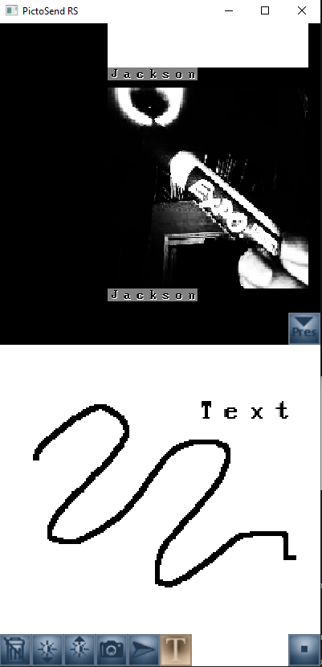

# PictoSend RS

### Send pictures and drawings to chat with friends!

### Rewrite of my "C Pictochat" project in Rust.

### Known Problems:

- Currently relies on Windows API for flashing the window upon receiving new messages.

- Has no graceful way of handling wrong server IP / server being down, just crashes for now.

Setup:

1) First, `cargo run` inside of /psrs_server to run the server. Server runs on port 6969 (TODO: Allow choosing the port.)

2) Open a new terminal and go back to root directory. `cargo run` to run client. Enter any username, and `localhost:6969` to connect to your local 6969 port.

3) Send messages! Camera mode puts your webcam's image in the background of your pictures. (TODO: Don't just crash when webcam isn't present. Oops!)
